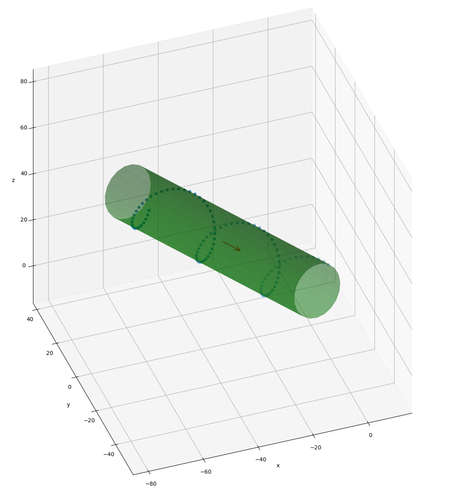
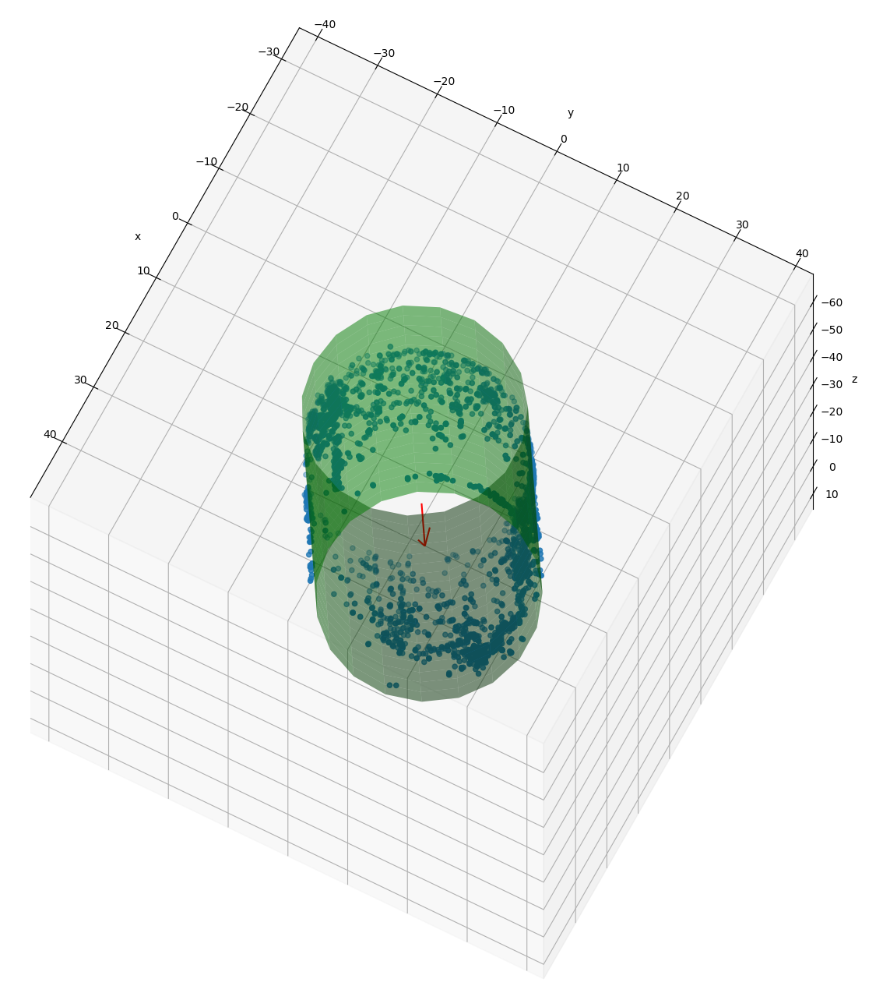

# fast cylinder fitting

Fit a set of 3D points to a cylinder surface.
 - this is a fast version of https://github.com/xingjiepan/cylinder_fitting
 - the loops were replaced with vectorized operations using numpy

# usage example:

.. code-block:: python

      from cylinder_fitting import fit
      w_fit, C_fit, r_fit, fit_err = fit(data)
# Example of cylinder fitting to a set of generate points

# Example of cylinder fitting to a set of real data

